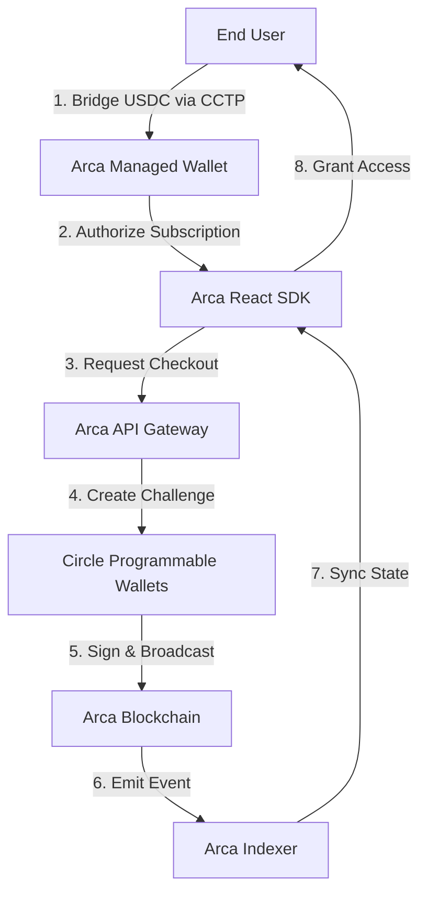

# Arca Protocol

The production-grade, USDC-native membership infrastructure for Web3.

Arca allows developers to integrate high-performance, predictable subscription payments into their applications with just a few lines of code. By combining Circle's Programmable Wallets, CCTP, and the Arc blockchain, we've built a membership experience that feels like Web2 but is powered by Web3.

## The Problem

Traditional Web3 payments are fragmented and manual. For businesses, managing memberships on-chain is a nightmare:
- **Gas Complexity**: Users need native tokens (ETH, MATIC) just to pay for a USDC subscription.
- **Liquidity Fragmentation**: User funds are often stuck on disparate networks while the subscription contract lives on Arc.
- **Data Silos**: Tracking subscription state (active/expired) requires complex, custom indexing logic.
- **High Friction**: Bridging and paying across different chains takes multiple steps and minutes of waiting.

## The Arca Solution

Arca provides a unified "One-Click Access" experience by leveraging cutting-edge infrastructure:

1.  **USDC-as-Gas (Arc Blockchain)**: Users pay for memberships and network fees entirely in USDC. No more worrying about native gas tokens.
2.  **Cross-Chain Liquidity (Circle CCTP)**: Native integration with **Circle's Cross-Chain Transfer Protocol (CCTP)** allows users to bridge USDC directly into their Arca membership wallet with zero slippage.
3.  **Circle Wallets**: Support for Circle User-Controlled Wallets and Circle Modular Wallets for secure, automated transaction execution.
4.  **AutoPay via EIP-712**: Pre-authorized renewals using EIP-712 signatures and session keys with ERC-1271 verification on-chain.
5.  **High-Fidelity Indexing**: A custom indexing engine that provides millisecond-accurate membership status.

## System Architecture

## Arc Testnet: The USDC-Native Execution Layer

Arc is the primary execution engine for Arca. Unlike traditional blockchains, Arc is purpose-built for financial applications:

- **USDC as Native Gas**: Arc uses USDC as its native currency. This means transaction fees are paid directly in USDC, eliminating the "Gas Problem" where users need a secondary token (like ETH or MATIC) to move their money.
- **Sub-Second Finality**: Arc provides ultra-fast confirmation times, ensuring that subscription updates and bridges are processed almost instantly.
- **Circle-Managed Ecosystem**: Being part of the Circle ecosystem, Arc ensures native, secure, and regulated-grade USDC integration at the protocol level.
- **Predictable Fees**: Since fees are paid in a stablecoin, developers and users can predict transaction costs without worrying about volatile gas price spikes.

## Supported Ecosystems (v0.1.12)

Arca leverages Circle CCTP to enable seamless USDC bridging from major ecosystem testnets to the Arc execution layer.

### **Bridging Sources & Execution Chains**
- **Arc Testnet** (Primary Execution Layer)
- **Base Sepolia**
- **Arbitrum Sepolia**
- **Optimism Sepolia**
- **Ethereum Sepolia**
- **Avalanche Fuji**
- **Polygon Amoy**
- **Unichain Sepolia**
- **Linea Sepolia**
- **Sei Testnet**
- **World Chain Sepolia**
- **Ink Testnet**
- **XDC Apothem**
- **Monad Testnet**
- **Codex Testnet**

## Technology Stack

- **Core Protocol**: [Arc Testnet](https://circle.com) (Sub-second finality, USDC native gas).
- **Bridging**: [Circle CCTP](https://www.circle.com/en/cross-chain-transfer-protocol) (Native Cross-Chain Transfer Protocol).
- **Wallets**: Circle User-Controlled Wallets, Circle Modular Wallets, and Privy Auth (Hybrid EOA/MPC Flow).
- **AutoPay**: Dedicated relayer that sweeps and executes pre-authorized renewals.
- **Frontend**: Next.js 15, Tailwind CSS, Framer Motion.
- **SDK**: React + tsup (CJS/ESM support).
- **Indexing**: Custom High-Performance Indexer.

## The Protocol Workflow

### 1. Plan Definition
Merchants define their subscription tiers in the Arca Dashboard.

### 2. CCTP Liquidity Check
The SDK checks the user's Arc balance. If empty, it initiates a **CCTP native bridge** from any supported source chain (e.g., Base Sepolia) to Arc.

### 3. Execution
The Arca Gateway triggers the `subscribe` function. Arc uses the bridged USDC to pay for transaction gas.

### 3b. AutoPay (Optional)
Users can pre-authorize renewals with an EIP-712 signature tied to a session key. The AutoPay relayer verifies on-chain eligibility and executes `subscribeWithSignature` when a cycle is due.

### 4. Indexing
The Arca Indexer picks up the transaction within 2 seconds, and the frontend instantly unlocks access.

## Security & Trust

- **CCTP Native**: No 3rd-party bridges. We use official Circle burn-and-mint logic.
- **Non-Custodial**: MPC-based key management ensures users retain control.
- **Signed Authorization**: EIP-712 typed data with ERC-1271 signature checks for AutoPay renewals.
- **USDC Native**: 1:1 backed stability across all supported testnets.

---

Built by the Arca Protocol Team.
