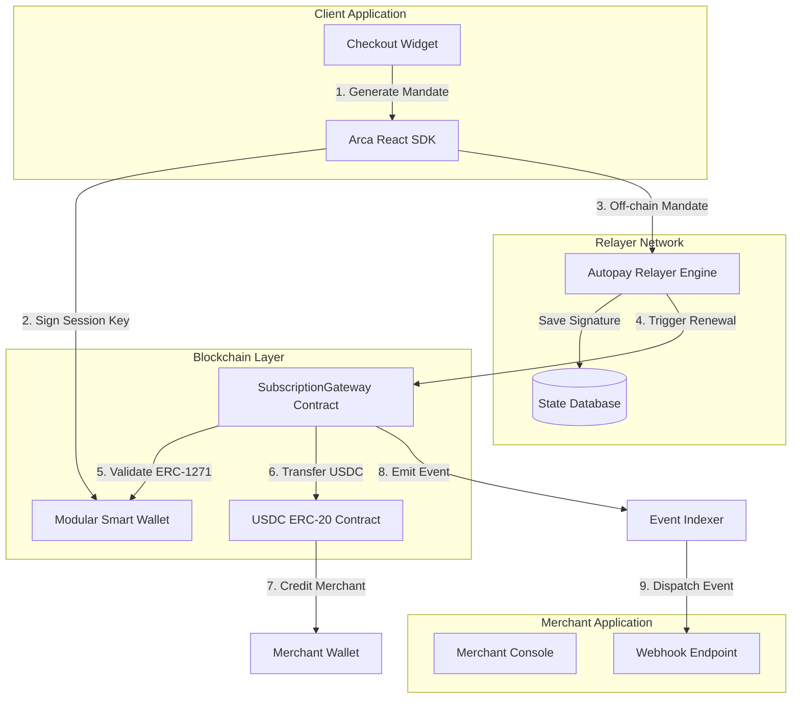

Arca is the primitive financial layer for automated, onchain subscription checkouts. Unlike traditional Web3 payments that require manual user approvals for every single transaction, Arca enables businesses to deploy Predictable, automated recurring stablecoin billing directly via smart contracts.

The core objective of Arca is simple: **Bring Web2 billing flexibility to Web3 rails with zero compromises on security or self-custody.**

---

## The Arca Philosophy

* **Self-Custody First**: Subscribers never yield control of their primary keys or wallets. Mandates are code-enforced, and allowances can be revoked instantly.
* **Gasless Experience**: Subscribers settle payments completely in USDC. Gas fees are sponsored by paymasters, removing the complexity of holding native chain gas tokens (like ETH, MATIC, or ARC).
* **Developer First**: Integrations require only a few lines of code via drop-in React widgets, connected directly to production-ready JSON REST APIs and secure webhooks.

---

## Core System Architecture

The Arca protocol consists of four distinct architectural components working in unified synergy:

### 1. The Arca React SDK
A library of drop-in React components (like the pricing table and payment widget) that handle smart wallet connections, auto-allowance approvals, ephemeral session key generation, and cryptographic mandate signing.

### 2. The Autopay Relayer
An off-chain event monitoring system that stores cryptographic session signatures and mandate metadata securely. The relayer tracks execution timelines and automatically triggers transactions on-chain when subscription periods expire.

### 3. The Subscription Gateway (`SubscriptionGateway.sol`)
The central smart contract protocol. It enforces subscription billing intervals, pricing tiers, cycle caps, and validates cryptographic signatures against modular smart contract wallets before transferring tokens.

### 4. Modular Smart accounts (ERC-4337)
Programmable contract wallets representing the user. Rather than operating via a simple private key, these accounts run custom execution logic, support ERC-1271 signature validation, and utilize gasless paymasters.

---

## Architectural Breakdown

To understand how Arca guarantees self-custody and high security for million-dollar billing operations, explore our multi-page deep-dive architecture guides:

<CardGroup cols={2}>
  <Card title="Modular Smart Accounts" icon="wallet" href="/architecture/smart-accounts">
    Learn how ERC-4337 Account Abstraction and Paymasters enable gasless recurring billing.
  </Card>
  <Card title="EIP-712 Session Keys" icon="key" href="/architecture/session-keys">
    Understand the off-chain cryptographic mandates that authorize scheduled renewals.
  </Card>
  <Card title="ERC-1271 Validation" icon="shield-check" href="/architecture/erc-1271">
    See how smart contracts delegate signature verification back to code-based wallets.
  </Card>
  <Card title="Autopay Relayer Loop" icon="rotate" href="/architecture/autopay">
    Explore the execution timeline, safety guards, and non-custodial settlement loop.
  </Card>
</CardGroup>
